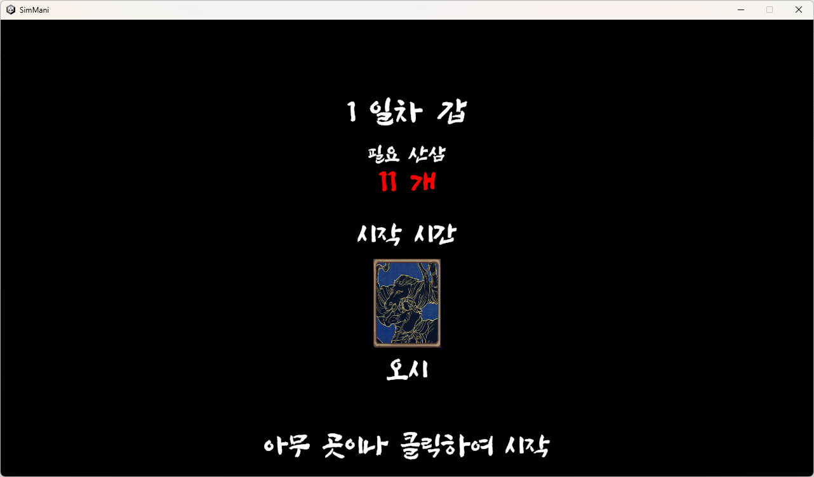
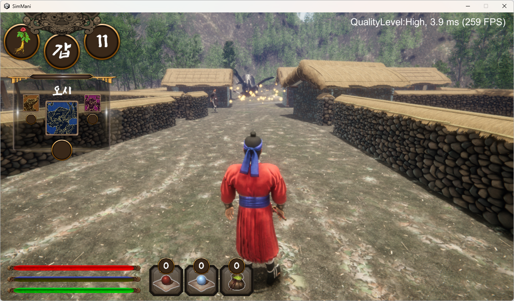
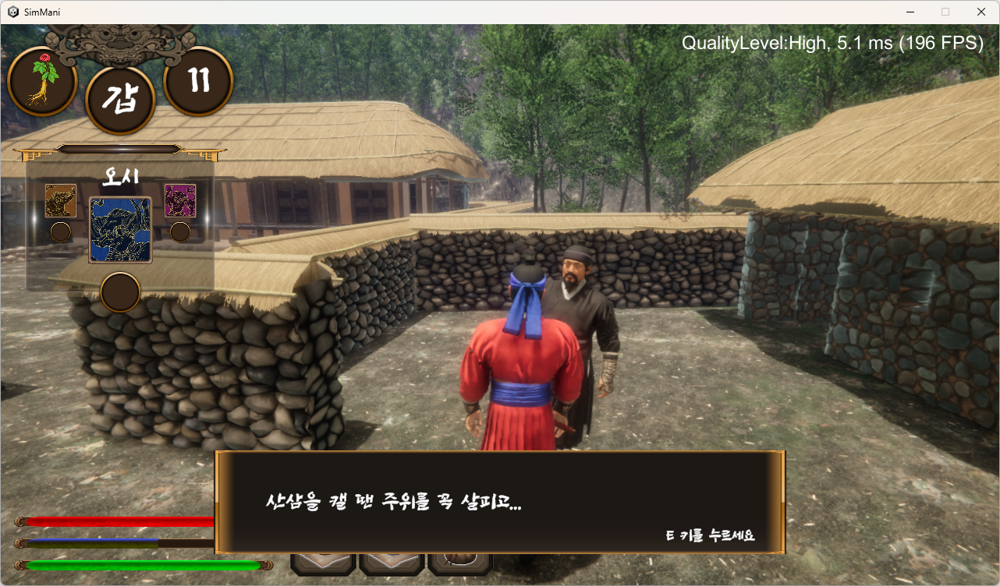
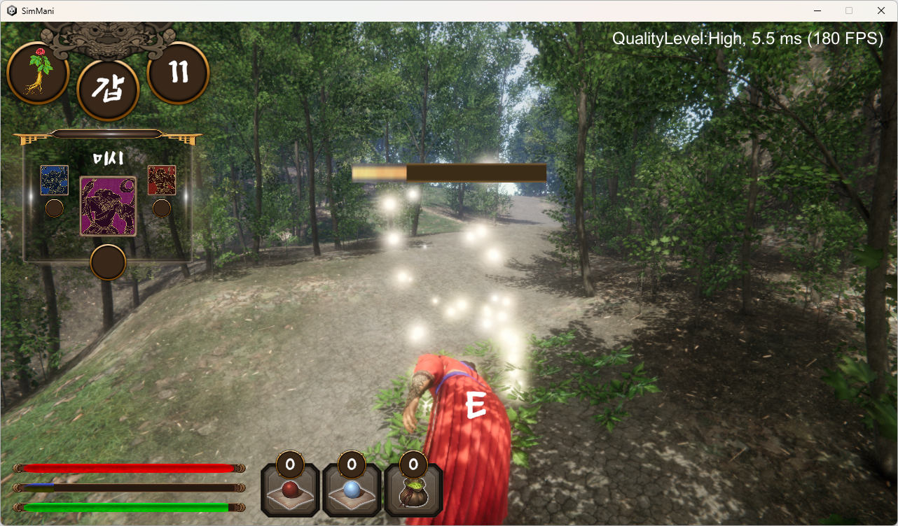
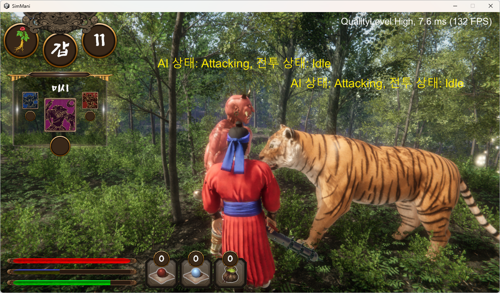
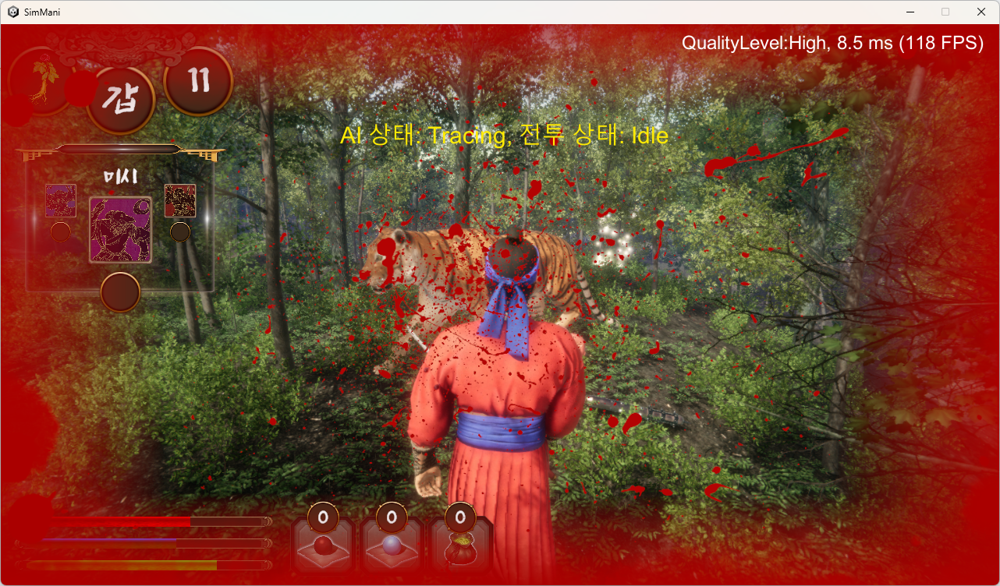
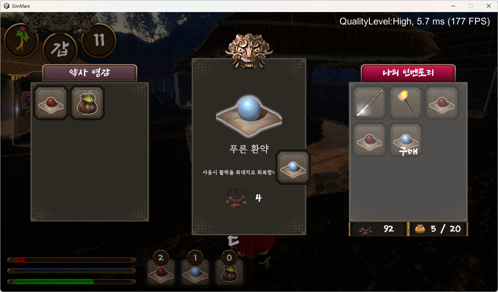
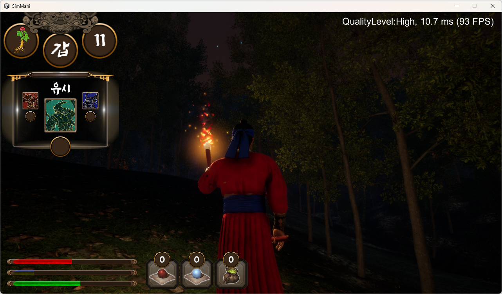
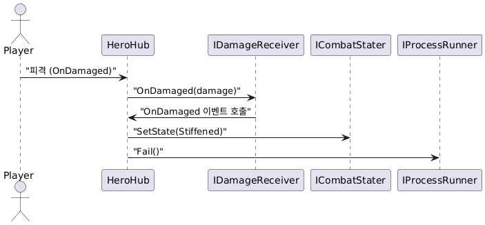

* 유료 에셋 사용으로 인해 소스코드만 등록되어 있습니다.
* 2025년 1월 현재 계속해서 작업 중인 프로젝트입니다.

# 심마니
## 장르
- 3D 생존 RPG
## 게임 소개
- 몬스터들을 피해 목표치만큼의 산삼을 채집해 오래 살아남는 것이 목표인 게임입니다.
<table>
  <tr>
    <td></td>
    <td></td>
  </tr>
  <tr>
    <td></td>
    <td></td>
  </tr>
  <tr>
    <td></td>
    <td></td>
  </tr>
  <tr>
    <td></td>
    <td></td>
  </tr>
</table>

## 소개 영상
https://www.youtube.com/watch?v=pqw_-IGxv8Q

## 개발 목적
- Unity 3D 기술 활용
- 디버깅과 확장이 용이한 설계 지향
## 담당 파트
- 모든 클라이언트 프로그래밍
- 일부 에셋 편집
## 개발 환경
- Unity 2022.3.45f1
- Unity Universal RP(URP) 14.0.11
- Adobe Mixamo

  캐릭터 모델 리깅 및 애니메이션 추가에 활용
- Blender 4.2

  캐릭터 에셋 간단한 편집에 활용
## 작업 기간
- 2024년 10월 ~ 12월
## 빌드
- [구글 드라이브](https://drive.google.com/file/d/1BLxmyynvWDg6LR1g5DV5Ho8IA1CaVsni/view?usp=sharing)
- 데이터 저장/로드, 게임 오버, 서브 퀘스트 등은 작업 중에 있습니다.

조작법

- WASD: 이동  
- 마우스 이동: 카메라 방향 전환  
- 마우스 좌클릭: (무기 장착 시) 공격  
- Space Bar: 점프  
- Left Shift: 가속  
- I: 인벤토리창 열기  
- E: 상호작용  
- Enter: (산에서) 메뉴 씬으로 돌아가기  
- F1 ~ F4: 그래픽 옵션 변경(Low ~ Ultra)  

## 사용 에셋
- TextMeshPro
- Cinemachine
- Terrain Tools
- 문화체육관광부 메타버스 데이터랩

  플레이어 캐릭터 모델 에셋
- Nature Package - Forest Environment

  환경(Terrain, Tree, Grass) 에셋

- Firefly Flare

  ParticleSystem 기반 이펙트 에셋
- FastSky - Procedural Sky and Clouds URP

  SkyBox 에셋
- KHS - Naganeupseong Walled Town, Suncheon

  마을 오브젝트 모델 에셋
- Oni Demon-Samurai

  적 모델 에셋
- Bengal and African Tiger

  적 모델 에셋
- Campfires & Torches Models and FX!

  횃불 모델 에셋

## 주요 기능
#### 1. 모듈 중심 설계
- **개요**
  - 각 기능을 독립적인 모듈로 설계하여 재사용성과 유지보수성을 추구.
  - 독립적인 모듈들이 게임 내 하나의 개체(Entity)를 형성.
  - 각 모듈을 **설정 데이터(Config)**, **런타임 데이터(Model)**, **구현(Implementation)** 구조로 설계.

- **효과**
  - 새로운 기능 추가 시 독립적인 모듈만 개발하여 쉽게 확장 가능.
  - 모듈 재사용을 통해 반복적인 코드 작성을 방지.
  - 개발 속도와 유지보수 효율성 향상.
  - 인터페이스를 사용해 모듈 변경 가능.
  

예시

**모듈 예시**
| 모듈명         | 역할                                    |
| ------------- | ------------------------------------- |
| **AI**         | 적 캐릭터 등 NPC의 행동 상태를 관리 (Idle, Trace, Attack 등). |
| **CombatStater** | 전투 중 상태(Idle, Stiffened, Attacking 등) 관리. |
| **DamageReceiver** | 공격에 의한 피해 처리 및 피격 이벤트 발생.        |
| **DamageSender**   | 적 또는 플레이어의 공격 로직 처리.           |
| **Follower**       | 목표를 추적하고 이동 로직을 수행.            |
| **Jumper**         | 점프 동작을 관리.                        |
| **Mover**          | 유저 입력에 따른 기본 이동 처리 (걷기, 뛰기 등).             |
| **ProcessRunner**  | 자원 채집 등 상호작용 처리.               |
| **Rotator**        | 카메라 및 캐릭터 회전 처리.               |
| **TargetFinder**   | 목표(적, 플레이어 등)를 탐지.               |
| **Equipper**       | 장비 장착 및 해제 로직 처리.              |
| **FatigueController** | 피로도 시스템 관리 (스태미나 감소 등).      |

**활용 예**
| **개체**    | **모듈 이름**          | **설명**                                                                 |
|---------------|-----------------------|---------------------------------------------------------------------------|
| **Hero**      | IMover                | 플레이어의 이동 처리를 담당                                              |
|               | IJumper               | 점프 기능을 담당                                                         |
|               | IDamageReceiver       | 피격 이벤트 및 체력 관리                                                 |
|               | IEquipper             | 장비 착용 및 관리                                                        |
|               | ICombatStater         | 전투 상태 관리 (Idle, Attacking, Stiffened 등)                            |
|               | IProcessRunner        | 채집 등 특정 행동의 진행 처리                                            |
|               | ISprinter             | 플레이어의 달리기(스프린트) 상태 관리                                     |
| **Enemy**     | IFollower             | AI의 목표를 따라 이동하는 기능 관리                                      |
|               | ICombatStater         | 전투 상태 관리 (Idle, Attacking, Stiffened 등)                            |
|               | IDamageReceiver       | 피격 이벤트 및 체력 관리                                                 |
|               | IDamageSender         | 공격 이벤트 및 데미지 처리                                               |
|               | IEnemyAI              | AI의 상태 전환 및 행동 처리                                              |
|               | ITargetFinder         | 타겟 탐지 및 탐색 로직 처리                                              |

**플레이어 캐릭터(Hero)의 피격 처리 시퀀스**

**피격 기능(DamageReceiver) 모듈 예시**

[DamageReceiver - Config](./Scripts/Modules/DamageReceiver/IDamageReceiverConfig.cs)  
[DamageReceiver - Model](./Scripts/Modules/DamageReceiver/DamageReceiverModel.cs)  
[DamageReceiver - Implementation](./Scripts/Modules/DamageReceiver/DamageReceiver.cs)  

---

#### **2. AI 시스템 설계와 구현**
- **개요**  
  적 캐릭터의 다양한 행동(Idle, Trace, Attack)을 유연하게 확장 가능하도록 설계된 AI 시스템.
- **특징**
  - State Pattern을 사용하여 행동 전환(State Transition)을 관리.
  - `TargetFinder`, `Follower`, `CombatStater`, `EnemyAI` 등 모듈의 조합으로 구성.
  - 새로운 AI 행동 추가 시 모듈만 확장하면 간단히 추가 가능.
- **예시**
  - [EnemyHub](./Scripts/Hubs/Character/Enemies/EnemyHub.cs)
  - [EnemyAI](./Scripts/Modules/AI/Enemy/EnemyAI.cs)

---

#### **3. Object Pooling 구현**
- **개요**  
  자주 사용하는 오브젝트를 미리 생성하고 재활용하여 성능 최적화.
- **특징**
  - `PoolManager`를 사용해 적 캐릭터, 이펙트 등 재사용.
  - 메모리 할당/해제를 줄여 런타임 성능 향상.
- **예시**
  - [PoolManager](./Scripts/!Managers/PoolManager.cs)
  - [Poolable](./Scripts/!Managers/Poolable.cs)

---

#### **4. Command와 Interaction 시스템 통합 설계**
- **개요**  
  플레이어와 게임 오브젝트 간의 상호작용을 처리하는 트리거 시스템.
- **특징**
  - Command: 게임 내 특정 동작들을 객체화하여 재사용성 추구.
  - Interaction: 상호작용을 모듈화하여 상점, 대화, 채집 등 다양한 시나리오 처리. Command와 연계 가능.
- **예시**
  - [ConversationCommand](./Scripts/Commands/InteractionCommands/ConversationCommand/ConversationCommand.cs)
  - [InteractionPlayer](./Scripts/Modules/InteractionPlayer/InteractionPlayer.cs)

---

#### **5. Unity Editor 확장**
- **개요**  
  Unity에서 에디터 스크립트를 활용해 개발 효율성을 증대.
- **특징**
  - CustomPropertyDrawer를 통해 Inspector UI 개선.
- **예시**
  - [ShowIfDrawer](./Scripts/Editor/CustomPropertyDrawers/ShowIfDrawer.cs)
  - [ShowIfDrawer 사용 예시](./Scripts/Components/CharacterControllerPhysics.cs)

---

#### **6. CellData 생성 및 관리 시스템**
- **개요**  
  Terrain을 셀 단위로 나누어 데이터로 관리하는 시스템.
- **특징**
  - **CellDataCreator**를 통해 Terrain 및 NavMesh 정보를 분석하고, 적 캐릭터 스폰 가능 여부를 포함한 셀 데이터를 JSON 형식으로 저장.
  - 스폰 로직과 지형 데이터 연계를 통해 플레이어 캐릭터 주변에 자연스럽게 적 스폰.(NavMesh 영역 밖, 플레이어가 갈 수 없는 지역에 적 스폰 제한)
- **효과**
  - 스폰 가능한 위치 정보를 사전에 데이터화하여 관리.
  - 게임 플레이 중 실시간 연산을 줄여 최적화.
- **예시**
  - [CellDataCreator](./Scripts/Scenes/PlayScene/MountainScene/Mountain/CellDataCreator.cs)
  - [MountainData](./Scripts/Scenes/PlayScene/MountainScene/Mountain/MountainData.cs)

---

#### **7. Terrain Culling 최적화**
- **개요**  
  카메라 범위 밖의 Terrain을 비활성화하여 성능 최적화.
- **특징**
  - 카메라와 Terrain 간 거리 계산 후 비활성화.
  - 대규모 Terrain에서도 프레임 드랍 방지.
- **예시**
  - [TerrainCuller](./Scripts/Scenes/PlayScene/MountainScene/TerrainCuller/TerrainCuller.cs)

---

#### **8. Nature Package - Forest Environment 에셋 다듬기**
- **개요**  
  유료 에셋의 활용도를 극대화하기 위해 URP 환경에서 에셋을 최적화.
- **특징**
  - WindZone 효과 적용 문제 해결.
  - CustomEditor 스크립트를 수정해 RenderFace 문제 해결.
- **예시**
  - [에셋 수정 기록](https://galim7553.tistory.com/20)
---

#### **9. 캐릭터 에셋 편집 및 애니메이션 적용**
- **개요**  
  캐릭터 모델과 애니메이션을 Mixamo 및 Blender로 편집.
- **특징**
  - LOD 네이밍 규칙 정리.
  - Mixamo 애니메이션 적용.
- **예시**
  - [캐릭터 에셋 편집 기록](https://galim7553.tistory.com/16)

---

## 주요 사용 기술

| 항목명        | 설명      |
| ------------- | ------------- |
| Design Patterns  | - Factory Pattern: 객체 생성 로직을 캡슐화  - Singleton Pattern: 매니저 클래스 관리  - State Pattern: AI 상태 관리  - Command Pattern: 게임상 특정 동작들을 객체로 분리  - Strategy Pattern 응용: 오브젝트의 각 모듈을 인터페이스로 사용  - MVP Pattern: UI 요소들에 사용|
| UI Object Binding  | 자식 컴포넌트 자동 바인딩  |
| Object Pooling  | 자주 사용하는 Object를 Stack 기반으로 풀링  |
| Unity Editor Script  |  원본 에셋의 대규모 Collider 수정, CustomPropertyDrawer에 활용 |
| Scriptable Object  |  테스트 플레이 중 설정값 편집에 활용 |
| Extension Method  |  컴포넌트 바인딩, 리스트 중 랜덤 선택 등에 활용 |
| Avatar Mask |  3D 애니메이션에 활용 |
